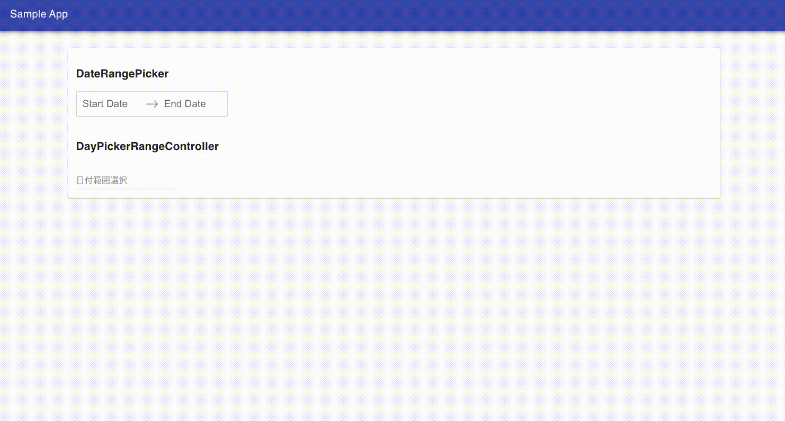

# react-dates-mobile-friendly

[react-dates](https://github.com/airbnb/react-dates) の DatePicker でレスポンシブする。

TextField と DatePicker がセットになっている `DateRangePicker` コンポーネントのレスポンシブ対応は容易だが、Date Picker 単体の `DayPickerRangeController` コンポーネントは style をカスタムする必要がある。

## Demo



## Environment

```
$ sw_vers
ProductName:    Mac OS X
ProductVersion: 10.15.6
BuildVersion:   19G2021

$ node --version
v12.18.2

$ npm --version
6.14.5

$ yarn --version
1.22.4

$ yarn list --depth=0
...

@material-ui/core@4.11.0
react-dates@21.8.0
react@16.13.1
typescript@3.7.5

...
```

## Usage

```
$ yarn install
$ yarn start
```
